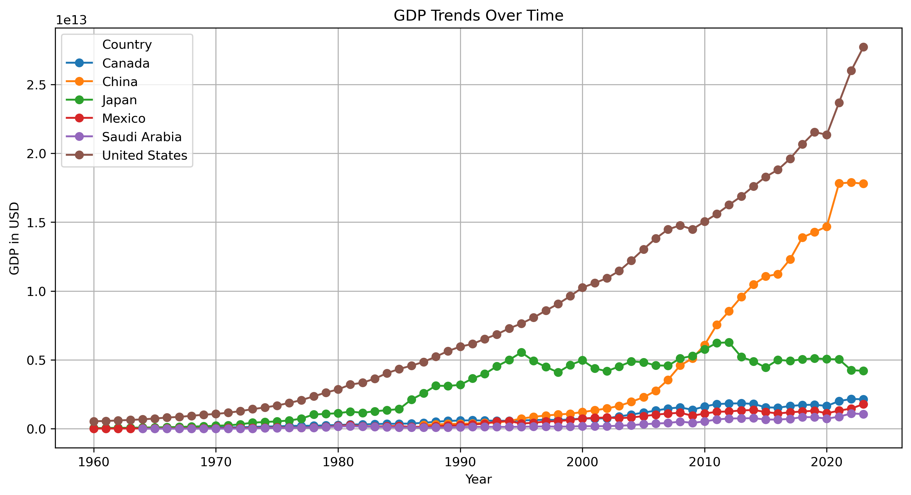
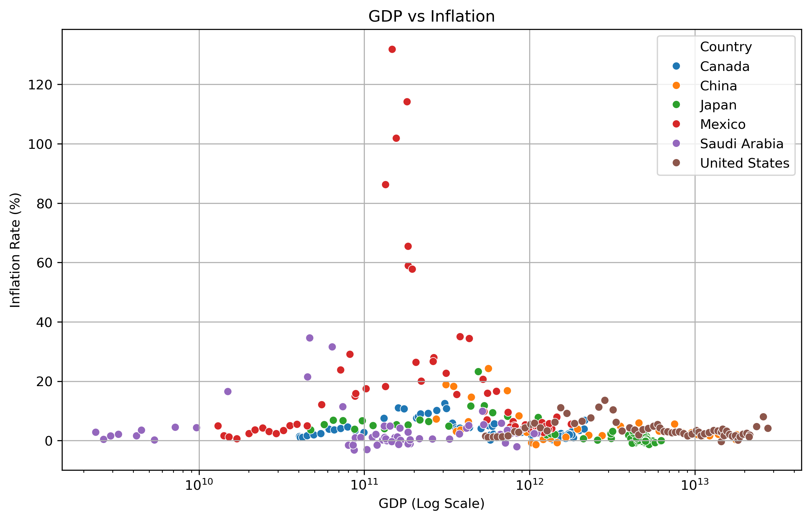
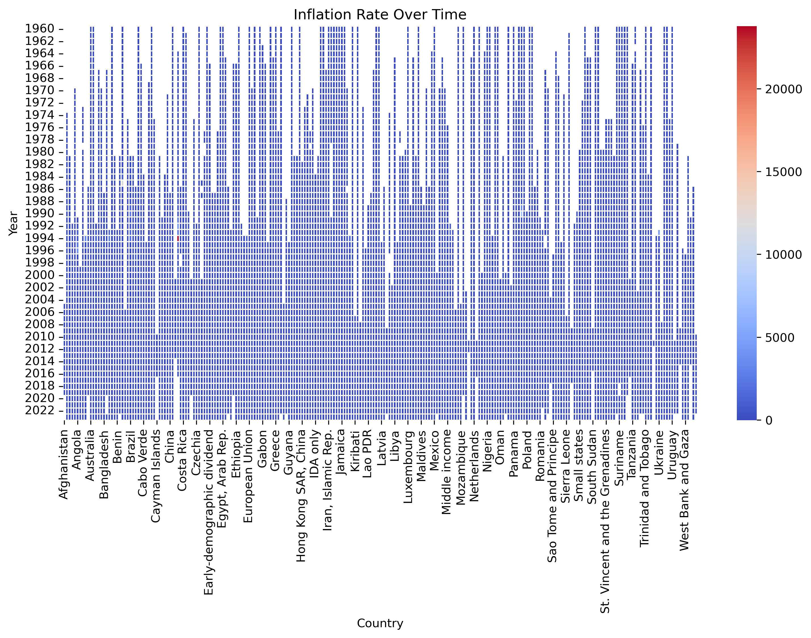

# global-economic-analysis
Analysis of global GDP and inflation trends using Pandas and Matplotlib"
## 📌 Overview  
This project analyzes **GDP and inflation trends** using data from the **World Bank**.  
Key insights include:  
- 📊 GDP Growth in major economies  
- 📉 Inflation trends over time  
- 🔍 Economic stability across countries  

## 🛠️ Technologies Used  
- **Python, Pandas, Matplotlib, Seaborn**  
- **Jupyter Notebook**  

## 📈 Visuals  
### GDP Trends Over Time  
  

### GDP vs Inflation  
  

### Inflation Over Time (Heatmap)  
  

### Average Inflation in High-GDP Countries  
.png)  

## 📂 Data Sources  
- [World Bank GDP Dataset](https://data.worldbank.org/indicator/NY.GDP.MKTP.CD)
- [World Bank Inflation Dataset](https://data.worldbank.org/indicator/FP.CPI.TOTL.ZG)
